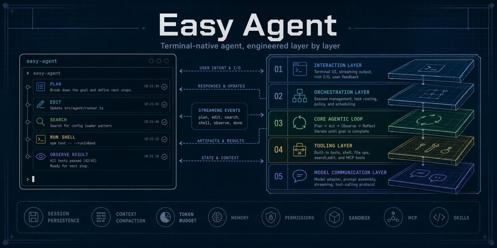

# Easy Agent

An open-source, terminal-native project to fully recreate the Claude Code experience from the ground up.



Easy Agent is a long-horizon engineering project focused on rebuilding a complete local agentic coding system in TypeScript and Node.js. The goal is not to publish isolated demos, but to incrementally construct a production-style coding agent with a clean architecture, strong safety boundaries, multi-turn orchestration, local tool execution, and the extensibility required for a full Claude Code-class developer experience.

This repository is the open-source implementation track of that effort. Full documentation will be added over time. For now, this README focuses on the project itself: what it aims to become, how it is structured, and where implementation currently stands.

> Chinese version: see [README.zh-CN.md](./README.zh-CN.md)

## Vision

Easy Agent aims to become a serious open-source recreation of a modern local coding agent system.

Core goals:

- Fully recreate the Claude Code-style workflow in an open-source codebase
- Keep the architecture layered, explicit, and extensible
- Prioritize real engineering systems over toy examples
- Evolve incrementally toward a complete local Agent CLI
- Preserve a stable path toward persistence, compaction, MCP, skills, sandboxing, sub-agents, multi-agent collaboration, multimodal input, plugins, and packaging

## Project Status

**Current stage:** Stage 32 — multimodal input, next

The implementation track has completed through Stage 31, including the CLI, streaming communication, tool execution, terminal UI, session orchestration, context management, MCP, skills, sandboxing, sub-agents, background execution, Agent Teams, hooks, output styles, user commands, rendering upgrades, unified configuration, file history, resilience, headless print mode, classifier-driven Auto Mode, multi-provider streaming, and the core-tool expansion for Web, MultiEdit, MCP resources, and PowerShell. Stage 32 is the next planned area: multimodal input for images and screenshots.

The single-file `step/` snapshots now cover Stages 1–31, so the completed implementation chapters can be studied from focused standalone files as well as from the main source tree.

Easy Agent should currently be understood as a serious open-source rebuild in progress rather than a finished end-user product.

## Architecture

Easy Agent is being built around a five-layer architecture:

```text
+---------------------------------------------------+
| 1. Interaction Layer                              |
|    Terminal UI, input handling, rendering         |
+---------------------------------------------------+
| 2. Orchestration Layer                            |
|    Multi-turn session flow, usage, commands       |
+---------------------------------------------------+
| 3. Core Agentic Loop                              |
|    Reason -> tool call -> observe -> continue     |
+---------------------------------------------------+
| 4. Tooling Layer                                  |
|    File, shell, search, web, MCP, local actions   |
+---------------------------------------------------+
| 5. Model Communication Layer                      |
|    Provider profiles and streaming LLM I/O        |
+---------------------------------------------------+
```

This separation makes the system easier to evolve:

- the **communication layer** handles provider selection, request translation, and streaming model I/O
- the **tool layer** exposes actionable capabilities
- the **agentic loop** drives single-turn autonomous execution
- the **orchestration layer** manages multi-turn state and control flow
- the **interaction layer** turns the runtime into a usable terminal product

## Repository Layout

```text
easy-agent/
├── src/
│   ├── entrypoint/      # CLI bootstrap
│   ├── ui/              # React/Ink terminal interface
│   ├── core/            # agentic loop and query orchestration
│   ├── agents/          # sub-agent definitions, registry, and runners
│   ├── tools/           # local tools and tool registry
│   ├── services/        # provider API, MCP, and skills services
│   ├── permissions/     # permission and safety controls
│   ├── context/         # system prompt and context management
│   ├── sandbox/         # Bash sandbox profiles and wrapping
│   ├── session/         # session persistence and history
│   ├── state/           # UI/runtime stores for tasks, todos, agents
│   ├── types/           # shared domain types
│   └── utils/           # env, config, logging, helpers
├── package.json
├── tsconfig.json
├── README.md
└── README.zh-CN.md
```

## Roadmap and Progress

The project follows a 37-phase roadmap designed to recreate the full Claude Code-style system progressively.

| Phase | Area | Core Code | Status |
|---|---|---|---:|
| 0 | Project scaffold | `planned in step series` | ✅ Done |
| 1 | LLM communication layer | [`step/step1.js`](./step/step1.js) | ✅ Done |
| 2 | React/Ink terminal UI | [`step/step2.js`](./step/step2.js) | ✅ Done |
| 3 | Tool interface and first tool | [`step/step3.js`](./step/step3.js) | ✅ Done |
| 4 | Core agentic loop | [`step/step4.js`](./step/step4.js) | ✅ Done |
| 5 | Complete core toolset | [`step/step5.js`](./step/step5.js) | ✅ Done |
| 6 | System prompt and context engineering | [`step/step6.js`](./step/step6.js) | ✅ Done |
| 7 | Permission control system | [`step/step7.js`](./step/step7.js) | ✅ Done |
| 8 | QueryEngine multi-turn orchestration | [`step/step8.js`](./step/step8.js) | ✅ Done |
| 9 | Session persistence and restore | [`step/step9.js`](./step/step9.js) | ✅ Done |
| 10 | Project memory system | [`step/step10.js`](./step/step10.js) | ✅ Done |
| 11 | Context compaction | [`step/step11.js`](./step/step11.js) | ✅ Done |
| 12 | Fine-grained token budget management | [`step/step12.js`](./step/step12.js) | ✅ Done |
| 13 | Plan mode | [`step/step13.js`](./step/step13.js) | ✅ Done |
| 14 | TodoWrite session task tracking | [`step/step14.js`](./step/step14.js) | ✅ Done |
| 15 | Task management system (V2) | [`step/step15.js`](./step/step15.js) | ✅ Done |
| 16 | MCP protocol support | [`step/step16.js`](./step/step16.js) | ✅ Done |
| 17 | Skills system | [`step/step17.js`](./step/step17.js) | ✅ Done |
| 18 | Sandbox | [`step/step18.js`](./step/step18.js) | ✅ Done |
| 19 | Sub-Agent and agent definitions | [`step/step19.js`](./step/step19.js) | ✅ Done |
| 20 | Background agents and worktree isolation | [`step/step20.js`](./step/step20.js) | ✅ Done |
| 21 | Agent Teams / multi-agent collaboration | [`step/step21.js`](./step/step21.js) | ✅ Done |
| 22 | Hooks lifecycle system | [`step/step22.js`](./step/step22.js) | ✅ Done |
| 23 | Output styles and user commands | [`step/step23.js`](./step/step23.js) | ✅ Done |
| 24 | Rendering experience upgrades | [`step/step24.js`](./step/step24.js) | ✅ Done |
| 25 | Configuration system improvements | [`step/step25.js`](./step/step25.js) | ✅ Done |
| 26 | File history and rollback | [`step/step26.js`](./step/step26.js) | ✅ Done |
| 27 | Error handling and resilience | [`step/step27.js`](./step/step27.js) | ✅ Done |
| 28 | Pipe mode / non-interactive execution | [`step/step28.js`](./step/step28.js) | ✅ Done |
| 29 | Auto mode classifier | [`step/step29.js`](./step/step29.js) | ✅ Done |
| 30 | Multi-provider support | [`step/step30.js`](./step/step30.js) | ✅ Done |
| 31 | Core tool expansion: Web, MultiEdit, MCP resources, PowerShell | [`step/step31.js`](./step/step31.js) | ✅ Done |
| 32 | Multimodal input: images and screenshots | `planned` | ⏳ Planned |
| 33 | Built-in command completion | `planned` | ⏳ Planned |
| 34 | Extended Thinking control and display | `planned` | ⏳ Planned |
| 35 | Plugins and marketplace | `planned` | ⏳ Planned |
| 36 | Packaging, publishing, and documentation | `planned` | ⏳ Planned |

The [`easy-agent/step/`](./step/) directory contains tutorial-friendly milestone code, so each completed chapter is directly learnable and reproducible from a focused single file.

Current implementation notes:

- Stage 31 is complete in source, article track, and the step snapshot series.
- Stage 32 multimodal input is next; it will connect image content blocks through tools, providers, compaction, and the terminal input flow.

## What Easy Agent Is — and Is Not

**Easy Agent is:**
- an open-source recreation project
- a systems-engineering effort
- a long-term implementation of a local coding agent
- a public codebase evolving toward a full Claude Code-class CLI

**Easy Agent is not:**
- a one-file demo
- a prompt-only wrapper around an API
- a finished product today
- a public mirror of any private course material

## Getting Started

### Requirements

- Node.js 22+
- npm
- Access to at least one supported model provider: Anthropic, OpenAI-compatible APIs, Gemini, or a local OpenAI-compatible endpoint such as Ollama

### Model Providers

Easy Agent supports multiple providers by default. Anthropic model names still work directly, while OpenAI-compatible and Gemini models are configured as named profiles in `settings.json` and selected with `--model` or `/model`.

Example user or project settings:

```json
{
  "defaultModel": "gpt",
  "models": {
    "gpt": {
      "protocol": "openai-chat",
      "model": "gpt-5.1",
      "baseURL": "https://api.openai.com/v1",
      "apiKey": "${OPENAI_API_KEY}"
    },
    "gemini": {
      "protocol": "gemini",
      "model": "gemini-2.5-pro",
      "apiKey": "${GEMINI_API_KEY}"
    },
    "ollama": {
      "protocol": "openai-chat",
      "model": "qwen2.5-coder",
      "baseURL": "http://localhost:11434/v1"
    }
  }
}
```

Common environment variables:

- `ANTHROPIC_AUTH_TOKEN` — Anthropic API token for raw Claude model names
- `ANTHROPIC_BASE_URL` — optional Anthropic-compatible API base URL
- `ANTHROPIC_MODEL` — legacy/default raw Anthropic model name
- `OPENAI_API_KEY` — OpenAI-compatible API key used by `${OPENAI_API_KEY}` profiles
- `GEMINI_API_KEY` — Gemini API key used by `${GEMINI_API_KEY}` profiles
- `WEB_SEARCH_API_KEY` — optional web search provider key

### Install

```bash
npm install
```

### Development

```bash
npm run dev
```

### Build

```bash
npm run build
npm start
```

### Example CLI Options

```bash
agent --help
agent --model claude-sonnet-4-20250514
agent --model gpt
agent --model gemini
echo "summarize this repo" | agent --print --output-format json
agent --plan
agent --auto
agent --dump-system-prompt
```

## Near-Term Priorities

The next major milestones are:

1. implement Stage 32 multimodal input for images and screenshots
2. continue with Stage 33 built-in command completion
3. add Extended Thinking controls and UI in Stage 34
4. close the extension ecosystem and packaging work in Stages 35–36

## Contribution Policy

Easy Agent is **not accepting external contributions at this stage**.

The project is still in active reconstruction, and the implementation, structure, and development conventions are expected to change frequently. External contributions will be opened after the project reaches a more stable and maintainable state.

Until then, you are welcome to follow the project and reference the public roadmap, but pull requests and outside code contributions are intentionally postponed for now.

## License

MIT
